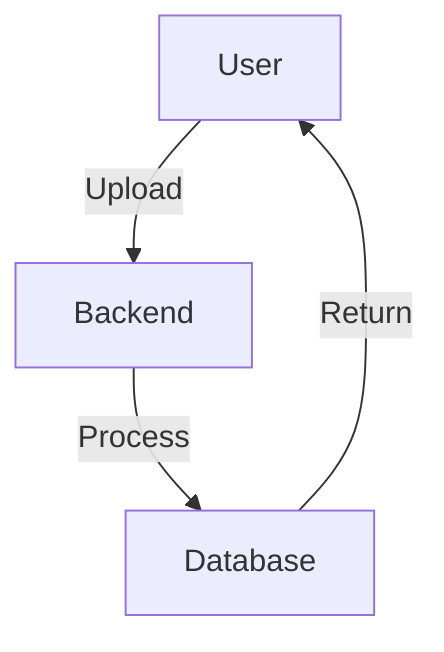

# Anki Flashcard App Documentation

This directory contains the complete documentation for the Anki Flashcard application, built with [Quartz 4](https://quartz.jzhao.xyz/).

## 🚀 Quick Start

### View Documentation Locally

```bash
cd docs
npx quartz build --serve
```

The documentation will be available at `http://localhost:8888`

### Build for Production

```bash
npx quartz build
```

Output will be in `docs/public/`

## 📚 Documentation Structure

```
content/
├── index.md                    # Home page
├── getting-started/
│   └── index.md               # Setup and installation
├── architecture/
│   └── index.md               # System design and architecture
├── features/
│   └── index.md               # Feature documentation
├── api/
│   └── index.md               # API reference
├── testing/
│   └── index.md               # Testing guide
└── deployment/
    └── index.md               # Deployment guide
```

## 🛠️ Development

### Prerequisites

- Node.js 20+
- npm 9.3.1+

### Install Quartz

Quartz is automatically downloaded via npx. No installation needed!

### Configuration Files

- `quartz.config.ts` - Main Quartz configuration
- `quartz.layout.ts` - Layout and component configuration
- `package.json` - npm scripts and metadata

### Writing Documentation

1. Create `.md` files in `content/`
2. Add frontmatter:
   ```md
   ---
   title: Your Page Title
   draft: false
   tags:
     - tag1
     - tag2
   ---

   # Your Content
   ```

3. Use [[wiki-links]] to link between pages
4. Save and the site will rebuild automatically

### Markdown Features

Quartz supports:

- ✅ GitHub Flavored Markdown
- ✅ Obsidian-style wiki links
- ✅ LaTeX math rendering (KaTeX)
- ✅ Syntax highlighting
- ✅ Mermaid diagrams
- ✅ Callouts and admonitions
- ✅ Tables of contents
- ✅ Backlinks
- ✅ Graph view

### Code Blocks

```typescript
// Syntax highlighting with language specified
const example = "This will be highlighted";
```

### Math

Inline: $E = mc^2$

Block:
$$
\int_{-\infty}^{\infty} e^{-x^2} dx = \sqrt{\pi}
$$

### Callouts

> [!NOTE]
> This is a note callout

> [!WARNING]
> This is a warning callout

### Diagrams



## 🌐 Publishing

### GitHub Pages

1. Build the site:
   ```bash
   npx quartz build
   ```

2. Deploy the `public/` directory

### Vercel

1. Connect repository to Vercel
2. Set build command: `cd docs && npx quartz build`
3. Set output directory: `docs/public`
4. Deploy

### Netlify

1. Connect repository
2. Build command: `cd docs && npx quartz build`
3. Publish directory: `docs/public`
4. Deploy

## 📝 Contributing

To contribute to the documentation:

1. Edit or create `.md` files in `content/`
2. Follow the existing structure
3. Use clear, concise language
4. Add code examples where relevant
5. Link related pages with [[wiki-links]]
6. Test locally before committing

## 🎨 Customization

### Theme Colors

Edit `quartz.config.ts`:

```typescript
colors: {
  lightMode: {
    light: "#faf8f8",
    lightgray: "#e5e5e5",
    // ...
  },
  darkMode: {
    light: "#161618",
    // ...
  }
}
```

### Fonts

```typescript
typography: {
  header: "Schibsted Grotesk",
  body: "Source Sans Pro",
  code: "IBM Plex Mono",
}
```

### Layout

Edit `quartz.layout.ts` to customize:
- Header and footer
- Sidebar components
- Page layout

## 📖 Resources

- [Quartz Documentation](https://quartz.jzhao.xyz/)
- [Markdown Guide](https://www.markdownguide.org/)
- [Obsidian Markdown](https://help.obsidian.md/Editing+and+formatting/Basic+formatting+syntax)

## 🤝 Support

- Report documentation issues: [GitHub Issues](https://github.com/techsavvyash/anki/issues)
- Suggest improvements: [GitHub Discussions](https://github.com/techsavvyash/anki/discussions)

## 📄 License

MIT License - See [LICENSE](../LICENSE) for details
